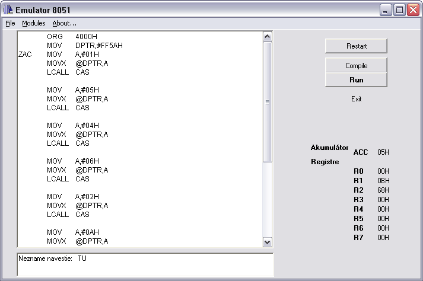
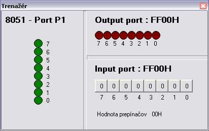
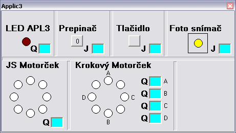
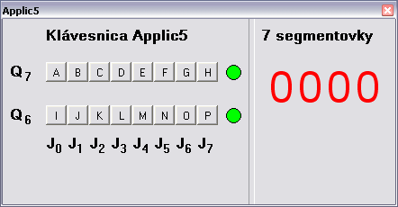

# emulator-8051

This is a very old project from my high school days, and probably my very first programming project. The goal was to create a tool for students to practice programming the 8051 microcontroller. The emulator parses ASM-like input code and simulates the execution of instructions, updating various virtual devices such as LEDs, a stepper motor, 7-segment displays, and reading binary inputs from virtual buttons.

## Features

- Emulates the 8051 microcontroller instruction set.
- Parses and executes assembly-like code from text files.
- Simulates virtual hardware:
  - LEDs
  - Stepper motor
  - 7-segment LED display
  - Binary input buttons
- Includes example programs demonstrating the use of the emulator and virtual devices.

## Project Structure

- `emulator.cpp`, `emulator.h`: Main emulator logic and UI.
- `Unit1.cpp`, `Unit1.h`: Core processor emulation.
- `Unit2.cpp`, `Unit2.h`: Virtual device: Trainer board.
- `Unit3.cpp`, `Unit3.h`: Virtual device: Application 3.
- `Unit4.cpp`, `Unit4.h`: Virtual device: Application 5.
- `C_ExternalDevices.cpp`, `C_ExternalDevices.h`: Interface for connecting virtual devices.
- `*.TXT`: Example programs for the emulator.
- `screenshot/`: Screenshots of the emulator UI.

## Notes

- This project was developed with Borland C++ Builder and uses VCL for the UI.
- It is unlikely to work on modern systems without significant modification.
- The code is preserved here for archival purposes as an example of my earliest programming experience.

## Screenshots

Below are some screenshots of the emulator UI:

Main window

LEDs and binary input

DC motor, stepper motor, photo sensor

Keyboard and 7 segment LED

## License

This project is archived as-is and is not maintained.

